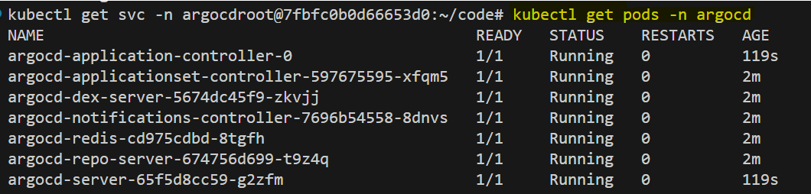
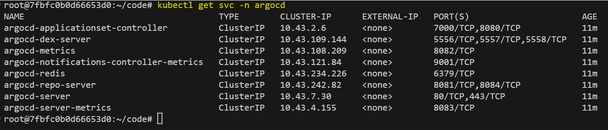

# ArgoCD Documentation

## What is ArgoCD?
ArgoCD is a declarative, GitOps continuous delivery tool for Kubernetes. It automates the deployment of applications by monitoring a Git repository and syncing the desired state defined in the repository with the actual state in the Kubernetes cluster.

## Key Features
- Automated deployment of applications to target environments
- Support for multiple clusters
- Web UI and CLI for application management 
- SSO Integration
- Audit trails for application changes
- Health status analysis
- Automated sync policies
- Rollback capabilities

## Prerequisites
- Kubernetes cluster 
- kubectl CLI
- Git repository for storing manifests

## Installation

### Install ArgoCD

```bash
# Create namespace
kubectl create namespace argocd

# Apply ArgoCD manifests
kubectl apply -n argocd -f https://raw.githubusercontent.com/argoproj/argo-cd/stable/manifests/install.yaml
```


## Verification
```bash
# Check ArgoCD pods
kubectl get pods -n argocd
```



```bash
# Check ArgoCD services
kubectl get svc -n argocd
```




## Access the ArgoCD UI
```bash
# Port forward the ArgoCD server
kubectl port-forward svc/argocd-server -n argocd 8080:443

# Get initial admin password
kubectl -n argocd get secret argocd-initial-admin-secret -o jsonpath="{.data.password}" | base64 -d
```

Access UI at: https://localhost:8080
- Username: admin
- Password: (from above command)


## Sample ArgoCD Application YAML
```yaml
apiVersion: argoproj.io/v1alpha1
kind: Application

metadata:
  name: argocd-demo-express-app
  namespace: argocd

spec:
  project: default

  source:
    repoURL: https://github.com/Minhaz00/Demo-ArgoCD.git
    targetRevision: HEAD
    path: Manifest

  destination:
    server: https://kubernetes.default.svc
    namespace: myapp
    
  syncPolicy:
    syncOptions:
      - CreateNamespace=true
    automated:
      prune: true
      selfHeal: true

```

## How ArgoCD Works

1. **Git as Single Source of Truth**
   - Application configurations are stored in Git
   - Changes to applications are made through Git commits

2. **Continuous Monitoring**
   - ArgoCD constantly monitors the Git repository
   - Detects differences between Git state and cluster state

3. **Automated Sync**
   - When differences are detected, ArgoCD can automatically sync
   - Supports manual sync approval process
   - Rollback capabilities if deployment fails

4. **Health Checks**
   - Monitors application health
   - Provides status of Kubernetes resources
   - Integrates with common health check mechanisms

## Best Practices

1. **Repository Structure**
   - Use clear folder organization
   - Separate applications into different directories
   - Utilize Kustomize or Helm for environment management

2. **Security**
   - Change default admin password
   - Use RBAC for access control
   - Enable SSO when possible
   - Use private repositories for sensitive configs

3. **Sync Strategies**
   - Configure automated sync for dev environments
   - Use manual sync for production
   - Set appropriate prune and self-heal policies

4. **Monitoring**
   - Set up notifications for sync failures
   - Monitor ArgoCD metrics
   - Configure appropriate logging

## Troubleshooting

Common issues and solutions:
- Application not syncing: Check Git credentials and network connectivity
- UI not accessible: Verify port-forward and certificates
- Sync failed: Check application logs and events

